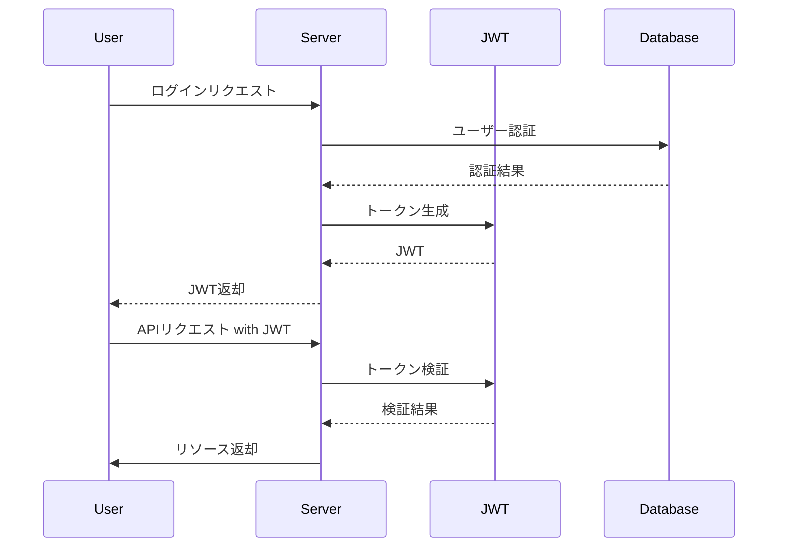
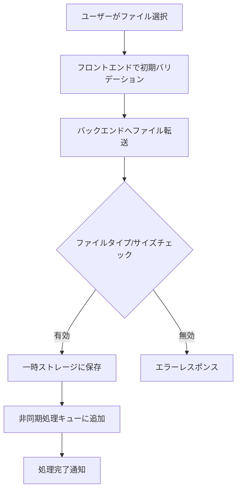

# Rust-based Video On-Demand Service: Detailed Design

## 1. バックエンドサービス構造

### 1.1 Web API サーバー (Actix-web)

- **構造**:
  - ルートハンドラ: サーバーの初期化とグローバル設定を管理
  - ルーティング: APIのバージョン管理とエンドポイントの構造化
  - ミドルウェア: 認証、ロギング、CORS等の共通処理

- **主要エンドポイント**:
  | エンドポイント | 説明 |
  |----------------|------|
  | `/api/v1/users` | ユーザー管理関連の操作 |
  | `/api/v1/videos` | 動画関連の操作 |
  | `/api/v1/auth` | 認証関連の操作 |

### 1.2 データベース設計 (PostgreSQL with Diesel ORM)

- **主要テーブル**:
  1. users
  2. videos
  3. categories
  4. tags
  5. user_subscriptions
  6. video_views

- **リレーションシップ**:
  - users 1:N videos
  - videos N:M categories
  - videos N:M tags
  - users 1:N user_subscriptions
  - users 1:N video_views

### 1.3 キャッシュシステム (Redis)

- **キャッシュ戦略**:
  1. ホットデータのキャッシング（よく見られる動画のメタデータ等）
  2. セッション情報の保存
  3. レート制限の実装

- **主要操作**:
  - セット: キーと値のペアを設定、必要に応じて有効期限を設定
  - ゲット: キーに対応する値を取得
  - 削除: キーと値のペアを削除

## 2. 認証と認可システム

### 2.1 JWT認証フロー

### 2.2 RBAC (Role-Based Access Control)

- **ロール定義**:
  | ロール | 権限 |
  |--------|------|
  | 管理者 | すべての操作が可能 |
  | コンテンツクリエイター | 動画のアップロード、編集、削除が可能 |
  | 一般ユーザー | 動画の視聴、コメントが可能 |

- **権限チェックフロー**:
  1. ユーザーリクエスト受信
  2. JWTからユーザーID取得
  3. ユーザーIDに基づきロール情報取得
  4. リクエストされた操作に必要な権限とユーザーのロールを比較
  5. 権限が十分であれば操作を許可、不足していれば拒否

## 3. 動画処理パイプライン

### 3.1 動画アップロードフロー

### 3.2 トランスコーディングプロセス

1. 元動画ファイルの読み込み
2. 動画情報（解像度、ビットレート等）の解析
3. 複数品質での変換設定（例: 1080p, 720p, 480p, 360p）
4. FFmpegを使用した変換処理
5. 変換済みファイルの保存
6. メタデータのデータベース更新

### 3.3 HLSセグメント化

1. トランスコード済み動画ファイルの読み込み
2. 指定された長さ（例: 10秒）でセグメント分割
3. マスタープレイリスト (.m3u8) の生成
4. 品質ごとのプレイリスト生成
5. セグメントファイルとプレイリストの保存

## 4. ストリーミングシステム

### 4.1 HLSマニフェスト構造

- マスタープレイリスト (.m3u8)
  - 複数の品質オプションを列挙
  - 各品質オプションに対応するプレイリストへのリンク

- 品質別プレイリスト
  - セグメントファイルへのリンク
  - セグメントの継続時間情報

### 4.2 動画配信フロー

1. ユーザーがビデオプレイヤーで再生リクエスト
2. マスタープレイリストの取得
3. クライアント側で適切な品質の選択
4. 選択された品質のプレイリスト取得
5. セグメントファイルの順次ダウンロードと再生

## 5. 検索・推薦システム

### 5.1 Elasticsearch統合

- **インデックス構造**:
  | フィールド | 型 | 説明 |
  |------------|----|----|
  | id | keyword | 動画のユニークID |
  | title | text | 動画タイトル（全文検索対象） |
  | description | text | 動画説明（全文検索対象） |
  | tags | keyword | タグ（完全一致検索） |
  | upload_date | date | アップロード日 |
  | view_count | integer | 視聴回数 |

- **検索フロー**:
  1. ユーザーの検索クエリ受信
  2. Elasticsearchへのクエリ構築（Multi-match query使用）
  3. 検索結果の取得
  4. 結果のランキングと整形
  5. レスポンス返却

### 5.2 推薦システム

- 協調フィルタリングアルゴリズムの実装
- ユーザーの視聴履歴と類似ユーザーの好みに基づく推薦
- コンテンツベースのフィルタリング（タグ、カテゴリーに基づく推薦）

## 6. 監視とログシステム

### 6.1 OpenTelemetry統合

- 分散トレーシングの実装
  - リクエストの追跡
  - マイクロサービス間の通信の可視化

- メトリクス収集
  - システムリソース使用状況
  - アプリケーションパフォーマンス指標

- ログ集約
  - 構造化ログの生成
  - 中央ログリポジトリへの送信

### 6.2 モニタリングダッシュボード

- Grafanaを使用したリアルタイムモニタリング
- アラート設定（異常検知時の通知）
- カスタムダッシュボードの作成（KPI監視用）

この詳細設計書は、Rustベースの動画オンデマンドサービスの主要コンポーネントとその相互作用を説明しています。各セクションは、実装の指針となる重要な情報を提供していますが、具体的なコードは含んでいないため、実装段階での柔軟性を確保しています。

この設計に基づいて、開発チームは各コンポーネントの実装を進め、統合テストを行い、最終的に完全な動作システムを構築することができます。

さらに詳細な説明が必要な部分や、特に注目したい点はありますか？
